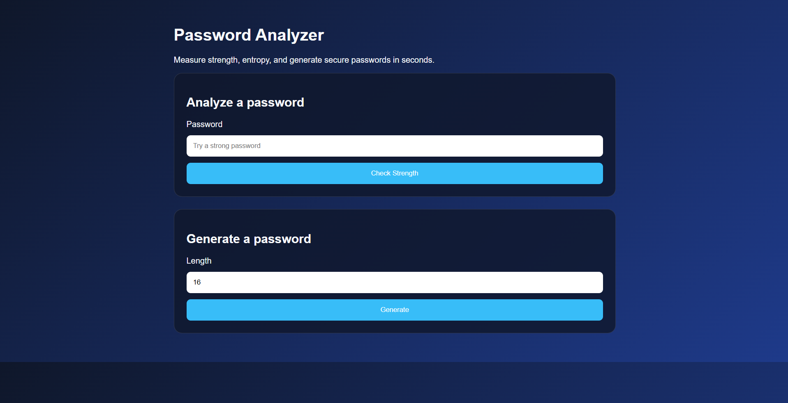
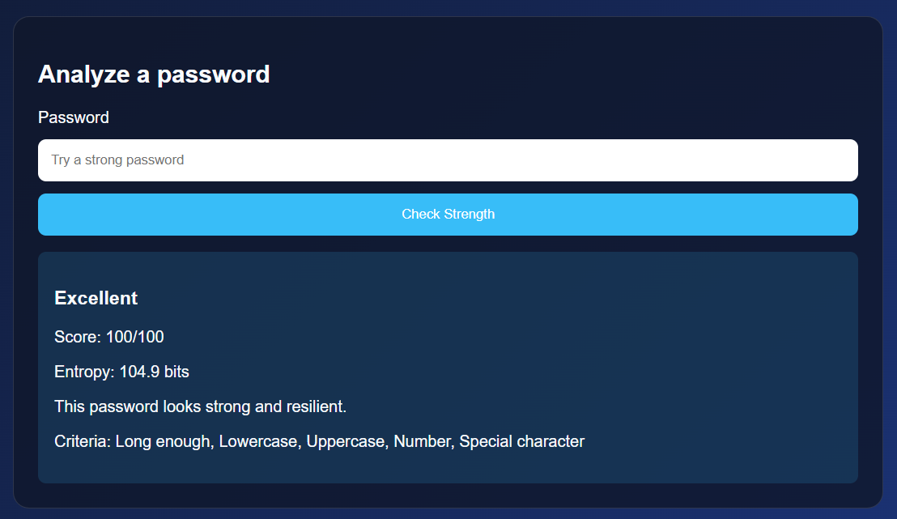
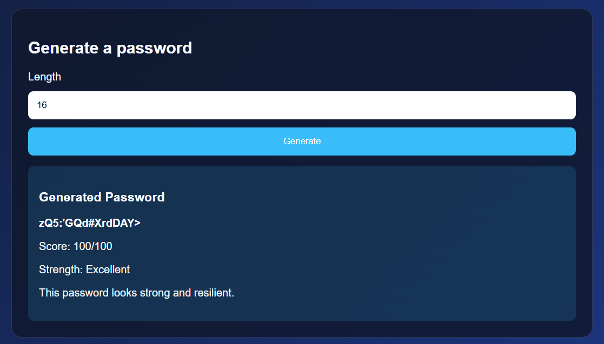
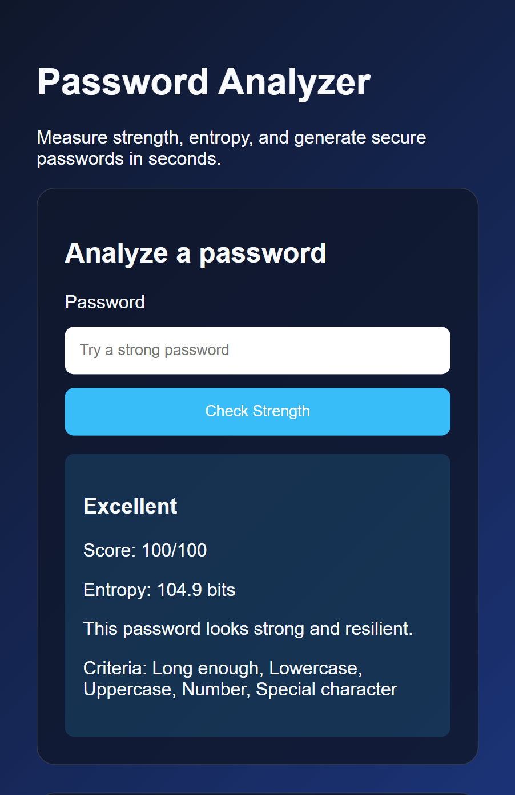
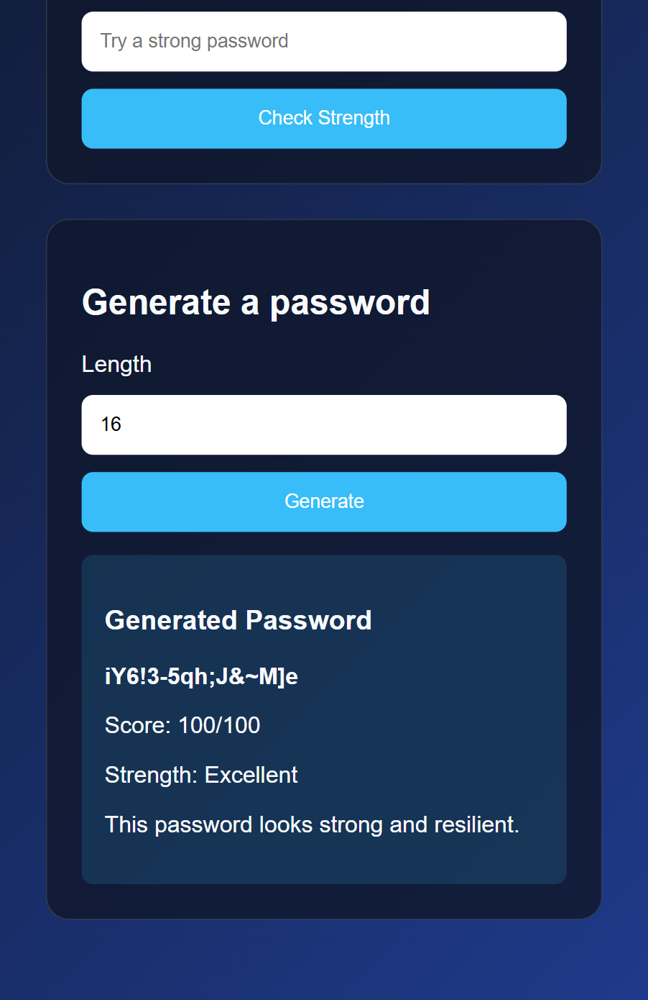

# PassSecure
A Python-based password security tool that analyzes password strength using entropy and complexity metrics while generating strong, secure passwords through an intuitive web interface.

## Features
- Analyze password strength with a scoring system and entropy estimate
- Generate strong passwords with mixed characters and configurable length
- Simple Flask-based web UI for quick use

## Run locally
1. Install dependencies: `pip install -r requirements.txt`
2. Start the app: `python app.py`
3. Open http://127.0.0.1:5000/

## Test
Run the test suite with:
`python -m unittest discover -s tests -q`

## Screenshots

### Home Page

### Password Analysis

### Password Generation

### Mobile View

| Password Analysis | Password Generator |
|-------------------|-------------------|
|  |  |
